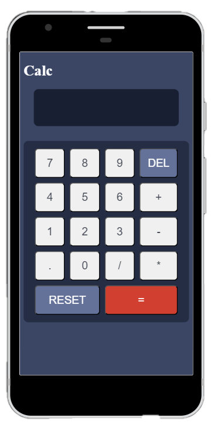

# calculator-app

## What's the project?
**It's a calculator. The design comes from [Front-end Mentors](https://www.frontendmentor.io/challenges/calculator-app-9lteq5N29)**

I did this project during my training at BeCode.org.

## Used languages
- HTML
- CSS
- Javascript

## ScreenShots
### Mobile version

### Desktop Version

